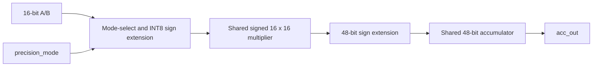

# Runtime-Reconfigurable Architecture

The implemented baseline reuses one signed 16×16 multiplier and one 48-bit
accumulator. INT8 mode sign-extends each low byte before the shared multiplier;
INT16 mode uses the complete operands.

This is runtime datapath selection, not FPGA partial reconfiguration. Reset and
clear take priority over accepted operations. Mode changes preserve accumulator
state and are transaction-safe because mode is used only at an accepting edge.
